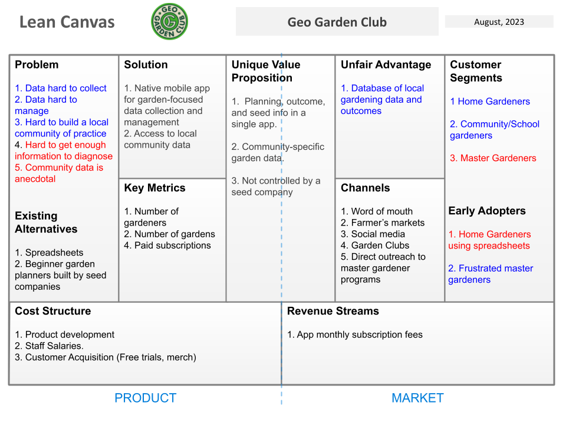

# In class: FTW Lean Canvas Brainstorm

## Setup (10 min) 

Prior to this exercise, we hope you will have reviewed [FTW Brainstorm Results](../ftw/reading-ftw-brainstorm-results.html) and chosen one of these projects to work on during this class period.

Philip will then divide up the class into groups of 2-3 depending upon your choices. 

Now, introduce yourself to your group mates: Your name, and and one of your favorite restaurants, and why you like it so much.

One person should create a google doc and provide write access to everyone on the internet, then share the link with the other group members.

Write down in your google doc all of the restaurants and why folks like them. You do not have to indicate which group member likes which restaurant.

## Create a Lean Canvas (20 minutes)

For your chosen project idea, develop a Lean Canvas as a way to outline the "business model" for the project. 

The [FTW Module](../../modules/ftw) provides a screencast and some examples of business ideas using Lean Canvas.

To create the Lean Canvas representation of your project:

1. One person in the group should go to the [Lean Canvas Google Sheet](https://docs.google.com/presentation/d/1PR5Qx3SpTLFsaNDiEivvd6_mBBuGkyrLOfFynXlN7u0/edit?usp=sharing), and create a copy of that template.

2. Change the access control for your copy to make it editable by anyone. 

3. Rename the template to indicate the project idea you are working on.

4. Explore the business proposition associated with your chosen project idea by building a Lean Canvas. 

<i class="fa-solid fa-circle-exclamation fa-xl"></i> **Example Lean Canvas**

When you have completed your Lean Canvas, please raise your hand to let Philip know.

## Group presentations

First, post a link to your canvas to the #canvas channel of our Discord server.

Second, discuss your canvas and what you found difficult to model. 

## Submission instructions

When group presentations are over, each person will login to Laulima and provide a link to your slide as evidence of your work on a Lean Canvas view of the project.
