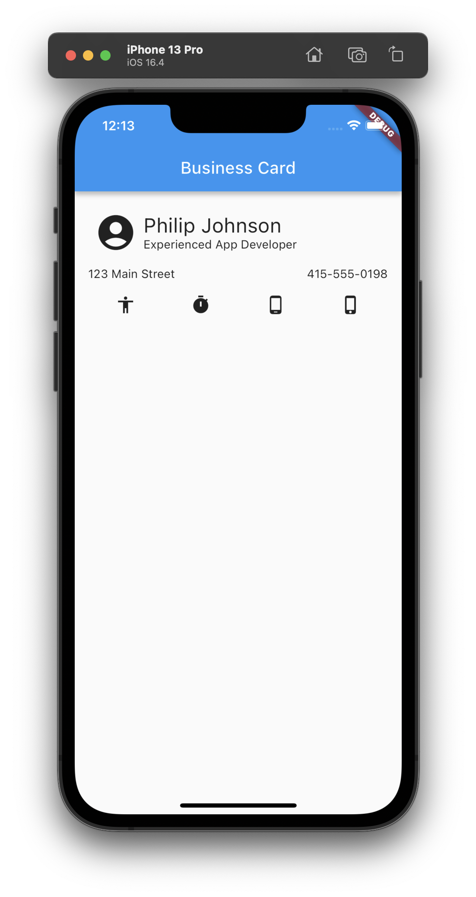

# Flutter Codelab: Basic Flutter layout concepts

<i class="fa-solid fa-circle-check fa-xl"></i> **Questions? We have answers.**

If you run into problems while doing this codelab,  please post to the #codelab-questions channel in Discord.

## Task

For this experience, start by going through the [Basic Flutter layout concepts](https://docs.flutter.dev/codelabs/layout-basics) Codelab. This Codelab uses DartPad, so use it. 

Once you've finished with the Codelab, please follow these steps to transfer the final code from DartPad into a working Flutter app.

1. Create a private GitHub repository called "flutter_business_card".  (Note the use of underscores, not hyphens. This follows Flutter best practices for app naming.) Add a README file to make it easier to clone to your desktop.
2. Make me a collaborator so I can view your work.
3. Clone it to your laptop.
4. In the parent directory of that directory, run `flutter create --no-overwrite flutter_business_card` in a terminal or shell window.  This will produce the Flutter app skeleton at the top level of your GitHub repo.
5. Change directory into flutter_business_card, and run `flutter run` to verify that your laptop is configured correctly for Flutter and can run the skeleton app. Once you've verified that it runs correctly, you can type "q" to quit execution.
5. Now open your repo in IntelliJ.
6. Open the iOS or Android Simulator, then run the template code and see it in the simulator. This verifies you can also run the system from within your editor.

Now that you've established a working codebase and development environment, you can replace the main.dart file contents with the final business card code.

<i class="fa-solid fa-circle-exclamation fa-xl"></i> **Notes**

* Delete test directory to get rid of red arrow under project.
* Add the main method to run the MyWidget widget.
* Add MaterialApp, Scaffold, and Padding to make the formatting appropriate for mobile.
* Please change the name of the business card to be your name. 
* Under the View | Tool Windows menu, select Dart Analysis to see if there are any warnings. If so, then remove them. 

You should see something like this:

When you've finished, commit your code to GitHub.

## Submission Instructions

No submission required.
